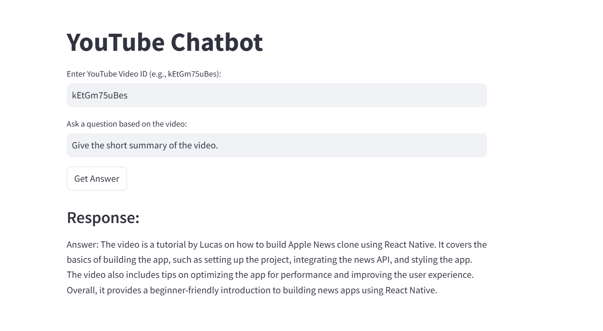
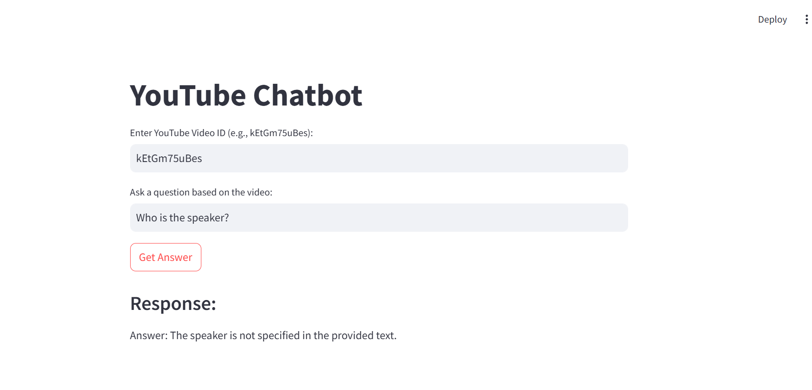

# YoutubeChatbot-LangChain-HuggingFace-Streamlit

This project is a chatbot that allows you to ask questions about the content of any YouTube video using its transcript. It leverages:

- `youtube-transcript-api` to extract video captions  
- LangChain for text chunking and multi-query retrieval  
- Hugging Face `zephyr-7b-beta` for LLM responses  
- FAISS for efficient semantic search  
- Streamlit for the user interface  

## 🚀 Features

- Enter a YouTube video ID and ask any question about the video  
- Uses a multi-query retriever to improve answer relevance  
- Runs entirely on your local machine using public APIs  

## 🛠️ Setup Instructions

1. **Clone the repository**

```bash
git clone https://github.com/Anjani27/YoutubeChatbot-LangChain-HuggingFace-Streamlit.git
cd YoutubeChatbot-LangChain-HuggingFace-Streamlit/Youtube_chatbot
````

2. **Add your Hugging Face token**

Create a file `.streamlit/secrets.toml` and add your API token:

```toml
HUGGINGFACEHUB_API_TOKEN = "your_huggingface_token_here"
```

3. **Install dependencies**

```bash
pip install -r requirements.txt
```

4. **Run the app**

```bash
streamlit run yt_chatmodel.py
```
## 📄 Folder Structure

```
Youtube_chatbot/
├── yt_chatmodel.py        # Main Streamlit app
├── requirements.txt       # Python dependencies
├── README.md              # Project description
└── .streamlit/
    └── secrets.toml       # Hugging Face API token
```


## ⚠️ Note on Deployment

This app may **fail to retrieve YouTube transcripts when deployed on cloud platforms** (e.g., Streamlit Cloud, AWS) due to YouTube blocking requests from shared/cloud IP addresses. 

https://youtubechatbot-langchain-huggingface-app-whqitvis4bnqfgzt2kfat.streamlit.app/

**Recommendation:** Run this app locally or on a machine with a personal/residential IP for best results.

## 📸 Screenshot

Here’s what the app looks like:


---



## 📝 License

This project is open-source under the MIT License.

 
