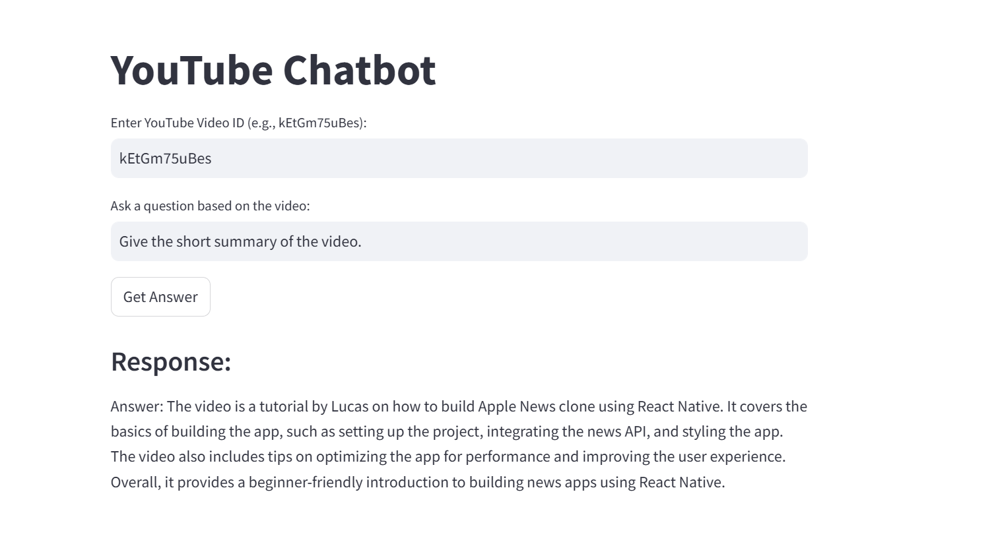
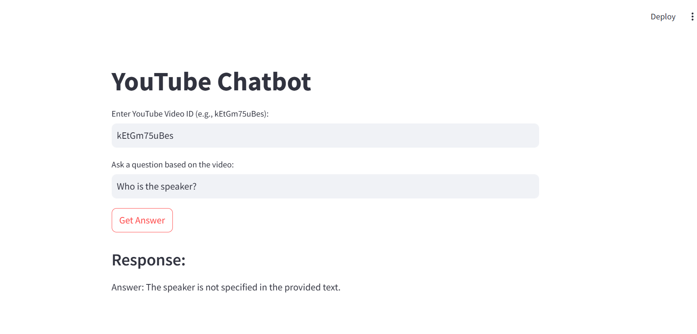

# YouTube Chatbot with LangChain, FAISS, Hugging Face Embeddings, and Groq

This project is a Streamlit-based chatbot that answers questions from a YouTube video transcript or a manually pasted transcript. It uses semantic retrieval and a Groq LLM to generate accurate, context-based answers.

The app supports both:

* **YouTube Video mode** → fetch transcript automatically
* **Paste Transcript mode** → manually provide transcript (recommended fallback)

It also supports **English and Hindi question answering**, replying in the same language as the user.

---

## 🚀 Features

* Ask questions based on a YouTube video
* Automatic transcript fetching using `youtube-transcript-api`
* Manual transcript input fallback
* Semantic search using **FAISS**
* Multilingual embeddings using Hugging Face
* Answer generation using **Groq (llama-3.1-8b-instant)**
* Automatic **Hindi/English language detection**
* Cleaned transcripts for better accuracy
* Supports **summary queries**
* Simple UI using **Streamlit**

---

## 🛠️ Tech Stack

* **Streamlit** – UI
* **youtube-transcript-api** – transcript extraction
* **LangChain Text Splitter** – chunking
* **Hugging Face Embeddings** – multilingual embeddings
* **FAISS** – vector search
* **Groq API** – LLM inference

---

## 📂 Project Structure

```
Youtube_chatbot/
├── yt_chatmodel.py        # Main Streamlit app
├── requirements.txt       # Dependencies
├── README.md              # Documentation
└── .streamlit/
    └── secrets.toml       # API keys
```

---

## ⚙️ How It Works

1. User selects:

   * YouTube Video OR Paste Transcript

2. Transcript is obtained:

   * Auto-fetched (Hindi → English fallback)
   * OR manually pasted

3. Transcript is cleaned (removes timestamps/noise)

4. Text is split into chunks

5. Embeddings are generated using Hugging Face

6. FAISS retrieves most relevant chunks

7. Groq LLM generates answer using only retrieved context

8. If query is summary-type → structured summary is generated

---

## 🛠️ Setup Instructions

### 1. Clone the repository

```bash
git clone https://github.com/Anjani27/YoutubeChatbot-LangChain-HuggingFace-Streamlit.git
cd YoutubeChatbot-LangChain-HuggingFace-Streamlit/Youtube_chatbot
```

### 2. Create virtual environment

#### Windows

```bash
python -m venv .venv
.venv\Scripts\activate
```

#### Mac/Linux

```bash
python -m venv .venv
source .venv/bin/activate
```

### 3. Install dependencies

```bash
pip install -r requirements.txt
```

### 4. Add Groq API key

Create file `.streamlit/secrets.toml`

```toml
GROQ_API_KEY = "your_groq_api_key_here"
```

---

## ▶️ Run the App

```bash
streamlit run yt_chatmodel.py
```

---

## 💡 Usage

### Option 1: YouTube Video

* Select **YouTube Video**
* Enter video ID
* Ask question

Example:

```
Video ID: kEtGm75uBes
Question: What is this video about?
```

---

### Option 2: Paste Transcript

* Select **Paste Transcript**
* Paste full transcript
* Ask question

---

## 🌐 Language Support

* English question → English answer
* Hindi question → Hindi answer

---

## 📝 Summary Queries

If your query includes:

* summary
* summarize
* brief
* overview
* gist

The app returns a **structured summary** instead of normal answer.

Example:

```
Give me a summary of this video
```

---

## ⚠️ Transcript Fetch Issues

Auto-fetch may fail due to:

* YouTube restrictions
* Cloud IP blocking (Streamlit Cloud, AWS)

### Solution:

Use **Paste Transcript mode** (most reliable)

---


## 📸 Screenshots

```


```

---

## 🔮 Future Improvements

* Accept full YouTube URLs
* Chat history support
* Show retrieved chunks
* Multi-language expansion
* Better deployment handling

---

## 📜 License

MIT License
